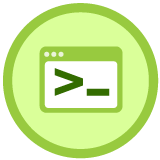

    <h1>Introducción a la Terminal y Línea de Comandos</h1>
    

## Tabla de contenido

- [Curso de Introducción a la Terminal y Línea de Comandos](#curso-de-introducción-a-la-terminal-y-línea-de-comandos)
  - [Primeros pasos](#primeros-pasos)
    - [¿Qué es la terminal?](#qué-es-la-terminal)
    - [Aprendiendo a caminar en la terminal](#aprendiendo-a-caminar-en-la-terminal)
    - [Manipulando archivos y directorios](#manipulando-archivos-y-directorios)
    - [Explorando el contenido de nuestros archivos](#explorando-el-contenido-de-nuestros-archivos)
    - [¿Qué es un comando?](#qué-es-un-comando)
    - [Wildcards](#wildcards)
  - [Empezando a correr](#empezando-a-correr)
    - [Redirecciones: cómo funciona la shell](#redirecciones-cómo-funciona-la-shell)
    - [Redirecciones: pipe operator](#redirecciones-pipe-operator)
    - [Encadenando comandos: operadores de control](#encadenando-comandos-operadores-de-control)
    - [Cómo se manejan los permisos](#cómo-se-manejan-los-permisos)
    - [Modificando permisos en la terminal](#modificando-permisos-en-la-terminal)
    - [Cómo configurar variables de entorno](#cómo-configurar-variables-de-entorno)
    - [Comandos de búsqueda](#comandos-de-búsqueda)
    - [Su majestad: grep](#su-majestad-grep)
  - [Utilidades de la terminal](#utilidades-de-la-terminal)
    - [Utilidades de red](#utilidades-de-red)
    - [Comprimiendo archivos](#comprimiendo-archivos)
    - [Manejo de procesos](#manejo-de-procesos)
    - [Procesos en foreground y background](#procesos-en-foreground-y-background)
    - [Editores de texto en la terminal](#editores-de-texto-en-la-terminal)
    - [Personalizar la terminal de comandos](#personalizar-la-terminal-de-comandos)

# Curso de Introducción a la Terminal y Línea de Comandos

## Primeros pasos

### ¿Qué es la terminal?
### Aprendiendo a caminar en la terminal
### Manipulando archivos y directorios
### Explorando el contenido de nuestros archivos
### ¿Qué es un comando?
### Wildcards

## Empezando a correr

### Redirecciones: cómo funciona la shell
### Redirecciones: pipe operator
### Encadenando comandos: operadores de control
### Cómo se manejan los permisos
### Modificando permisos en la terminal
### Cómo configurar variables de entorno
### Comandos de búsqueda
### Su majestad: grep

## Utilidades de la terminal
 
### Utilidades de red
### Comprimiendo archivos
### Manejo de procesos
### Procesos en foreground y background
### Editores de texto en la terminal
### Personalizar la terminal de comandos